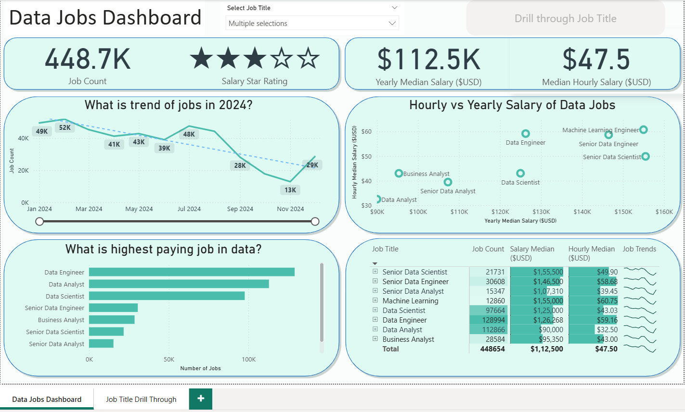

# 🌍 Global Data Jobs Dashboard  

  
<video src="https://github.com/user-attachments/assets/5b9a3bfb-1d4c-4b74-bcc7-06fd9cdfba3c" controls width="800"></video>

An interactive Power BI dashboard analyzing worldwide demand, roles, and salaries in the data industry.  
It provides insights into how data roles are evolving, where opportunities exist, and what drives compensation globally.

---

## 📸 Dashboard Preview  

  
*Main view showing global data roles, job counts, and salary insights.*

---

## 📘 Project Overview  

The **Global Data Jobs Dashboard** explores thousands of job postings from multiple countries to uncover patterns in hiring, pay, and demand across data-related roles.  
It’s designed to help job seekers, recruiters, and analysts understand which roles are most in-demand and how compensation varies geographically.

---

## 🎯 Objectives  

- Identify the most in-demand data roles worldwide.  
- Compare salary trends by job title and country.  
- Examine how location and employment type affect compensation.  
- Present all insights in a clear, interactive Power BI dashboard.

---

## 🧠 Key Insights  

- **Data Analytics roles dominate**, representing roughly **23.6%** of total postings.  
- **India** provides **average annual salary of $77K USD** for senior Analytics roles.  
- **Data Engineers** and **Data Scientists** follow closely with **$98K** and **$113K** averages.  
- Covers **32,000+ job listings** across **12 countries** and **8 major roles**.  
- Contract positions form **5%** of total listings, showing flexible hiring growth.  

---

## 📊 Dashboard KPIs  

| Metric | Value | Description |
|--------|-------:|-------------|
| **Total Job Count** | 479.9K | Total data-related job postings analyzed |
| **Avg Annual Salary (USD)** | $120K | Mean salary across all roles and regions |
| **Avg Hourly Pay (USD)** | $49.2 | Average hourly rate for part-time/contract jobs |
| **Highest Paying Country** | USA ($112K) | Top median salary market |
| **Top Role by Demand** | Data Engineer (129K jobs) | Most frequently posted role |
| **Experience Range** | 2–5 years | Most common requirement for data roles |

---

## 🖼️ Dashboard Drilldown  

  
*Interactive filters for role, country, and salary distribution.*

---

## 🧰 Tools & Technologies  

| Tool | Purpose |
|------|----------|
| **Power BI Desktop** | Visualization & dashboard creation |
| **Power Query** | Data cleaning and transformation |
| **DAX** | Calculated measures & KPIs |
| **Excel / CSV Dataset** | Data source |

---

## 🗂️ Dataset Information  

- **Source:** Public job posting dataset (cleaned for relevance).  
- **Fields:** Job Title, Country, Annual Salary (USD), Hourly Pay, Employment Type, Posting Date.  
- **Size:** ~478.9K records across multiple regions.  
- **Processing:** Cleaned and standardized using Power Query.

---

## 🚀 How to Run  

```bash
# 1. Download the dashboard file
jobs_drilldown_dashboard.pbix

# 2. Open it in Power BI Desktop

# 3. Load or refresh the dataset (CSV/Excel)

# 4. Interact with filters:
#    - Select roles to view salary and count by country
#    - Drill down by employment type or region
#    - Compare salary and demand trends visually
```
---

## 💡 Impact

- This dashboard empowers users to:

- Identify high-demand and high-paying data roles.

- Benchmark compensation trends across countries.

- Support data-driven career or hiring decisions.

---

## 📁 Project Structure
```
globle-data-jobs-dashboard/
│
├── jobs_drilldown_dashboard.pbix     # Power BI dashboard
├── dataset/                          # Cleaned data source (CSV/Excel)
├── images/                           # Dashboard screenshots
├── video/                            # Demo video file
└── README.md                         # Project documentation
```
---

## Future Enhancements

- Integrate live APIs for real-time job listings.

- Add filters for skill, experience level, and company type.

- Automate data refresh with Power BI Service.

---

## 👨‍💻 Author

**Devendra Singh**  
Data Analyst | SQL | Python | Power BI  
[](https://github.com/devendra-coder)
[](devendras162002@gmail.com)
[](www.linkedin.com/in/devendra-singh-adhikari)
